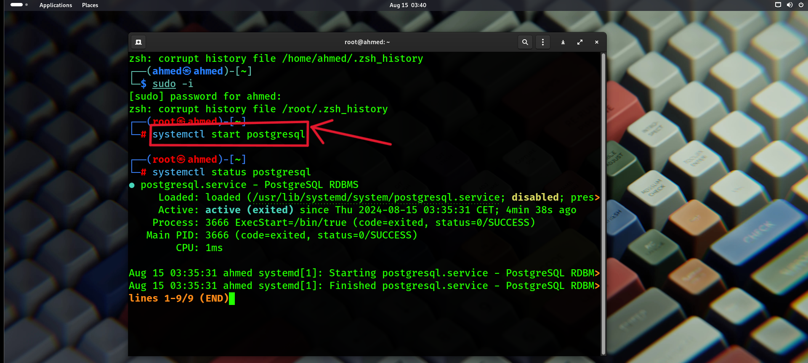
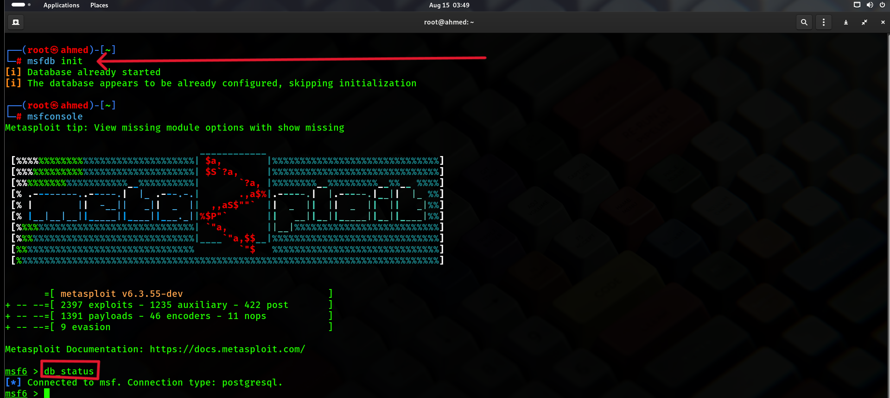
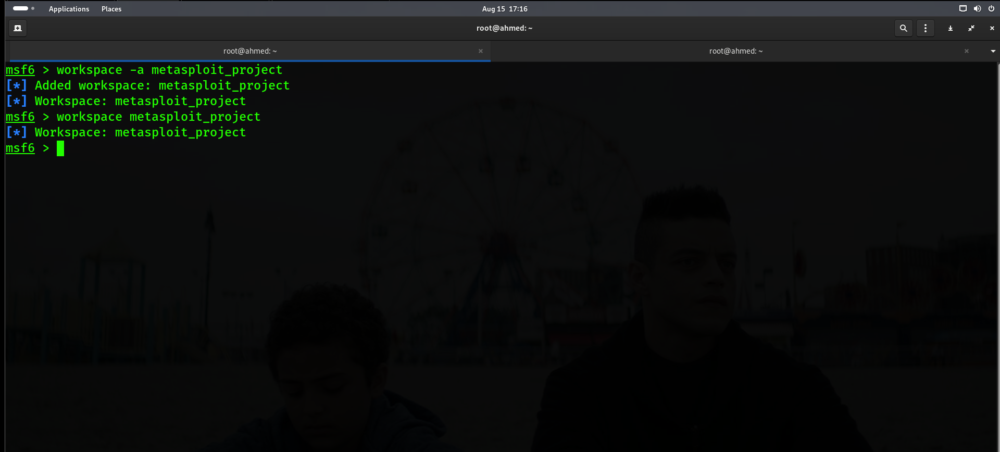
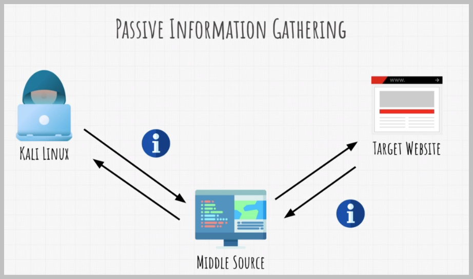
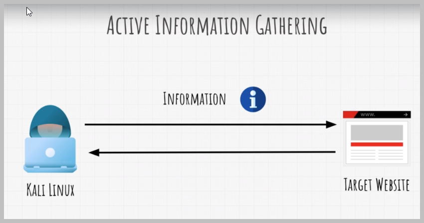
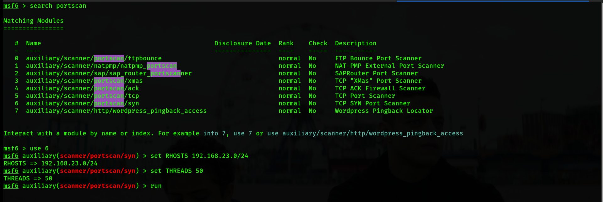
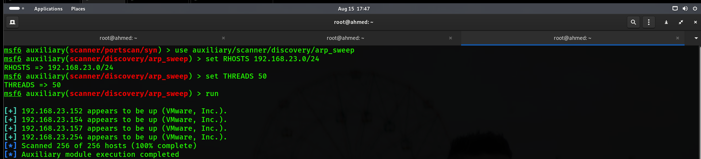
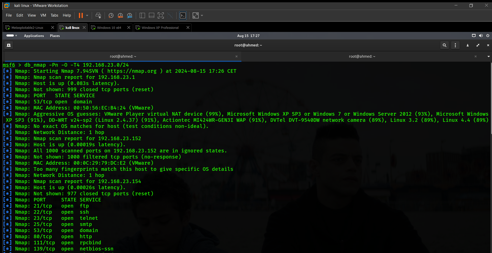
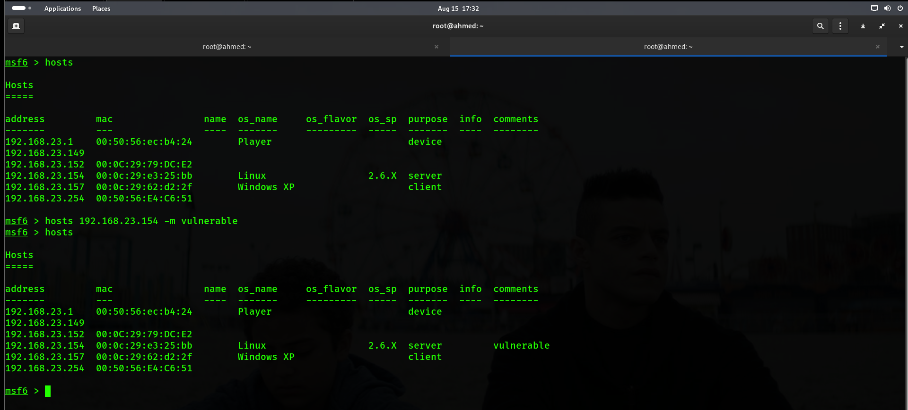
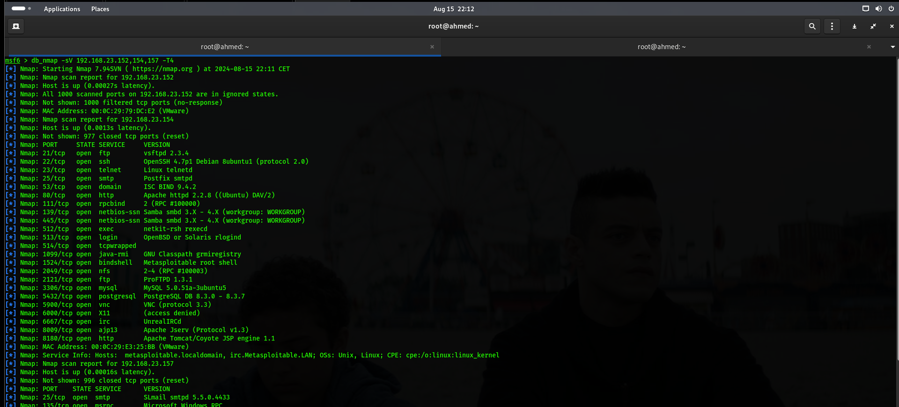

# Metasploit Penetration Testing Lab

This project demonstrates the use of Metasploit for penetration testing in a controlled lab environment. The lab consists of multiple virtual machines, each configured on a subnet for realistic testing scenarios.

## Lab Setup

### Network Configuration
- **Subnet:** 192.168.23.0/24

### Virtual Machines
- **Kali Linux**
  - **IP Address:** 192.168.23.149
  - **Role:** Attacker
  
- **Metasploitable 2**
  - **IP Address:** 192.168.23.154
  - **Role:** Vulnerable Target
  
- **Windows XP**
  - **IP Address:** 192.168.23.157
  - **Role:** Legacy System
  
- **Windows 10**
  - **IP Address:** 192.168.23.152
  - **Role:** Modern System

## Configuring PostgreSQL

An important feature of Metasploit is its backend database support for PostgreSQL, which allows us to store penetration-testing results effectively. Penetration tests often generate a large amount of data and can span several days. This makes it crucial to store intermediate results and findings, such as target host data, system logs, collected evidence, and report data, in a structured way. Metasploit’s integration with PostgreSQL enables quick and efficient storage of these results.

In this section, we will walk through the process of installing and configuring the PostgreSQL database on Kali Linux.

### Step 1: Start PostgreSQL Service

Before initializing the Metasploit database, we need to start the PostgreSQL server. we can do this by running the following command in your terminal:

```bash
systemctl start postgresql
```



### Step 2: Verify Database Initialization

As the database has already been configured, we skip the initialization step. However, if needed, the initialization can be done using the following command:

```bash
msfdb init
```

If the database is already configured, we may see the following output:



### Step 3: Verify Database Connection

We can verify that the database is successfully connected to Metasploit by launching Metasploit and checking the database status:

```bash
msfconsole
db_status
```

With the database configured, Metasploit automatically stores data from our sessions, including scanned hosts, vulnerabilities, and credentials. This feature helps us manage and analyze the results of our penetration tests efficiently.


## Creating Workspace

Workspaces in Metasploit are used to separate datasets, helping us stay organized throughout our penetration tests. By creating a new workspace for each test, we can ensure that our collected data remains isolated from previous or future tests, preventing any contamination or confusion.


To create a new workspace in Metasploit, we use the `-a` option followed by the desired workspace name. :

```bash
workspace -a metasploit_project
```



This command adds a new workspace where all the data from our current penetration test will be stored. This makes it easier to manage and review the data specific to each test.


# Information Gathering and Scanning

Information gathering and scanning are critical phases in penetration testing. These phases involve collecting data about the target network, systems, and applications to identify potential vulnerabilities. The information collected during these steps forms the foundation for the subsequent exploitation phase.


Information gathering, also known as reconnaissance, is the process of collecting as much information as possible about a target before launching an attack. This phase is crucial as it helps us understand the target’s structure, network topology, and security measures in place.

There are two primary types of information gathering:


#### 1. Passive Information Gathering

Passive information gathering involves collecting information about a target without directly interacting with the target system. This method typically involves searching publicly available information, such as WHOIS records, DNS queries, social media profiles, and other online resources. The key advantage of passive reconnaissance is that it is less likely to alert the target, as no direct probing or scanning occurs.




Examples of passive information gathering include:
- Searching for information in public databases and forums
- Analyzing metadata from publicly available documents
- Monitoring network traffic if accessible

#### 2. Active Information Gathering

Active information gathering, on the other hand, involves direct interaction with the target system. This method includes techniques like network scanning, port scanning, and vulnerability scanning, where the tester sends packets to the target to gather data. While more intrusive, active reconnaissance provides more detailed and accurate information about the target’s environment.



Examples of active information gathering include:
- Scanning the network to identify live hosts and open ports
- Enumerating services running on the target machines
- Using tools like Nmap or Metasploit’s auxiliary modules to detect vulnerabilities


For the purpose of our lab, we will focus on active information gathering. The reason for this choice is that our lab environment is designed to simulate real-world penetration testing scenarios where detailed and actionable information about the target systems is necessary. Active scanning will allow us to identify live hosts, open ports, running services, and potential vulnerabilities, which will be essential for the exploitation phase of our testing.


There are various ways to perform active information gathering. In this project, I will demonstrate three methods and then select the best one for our specific needs.

### 1. Portscan Modules in the Auxiliary Module

Port scanning is a fundamental technique in penetration testing, used to identify open ports and the services running on them. Metasploit provides several auxiliary modules for port scanning. In the image below, we have used the `auxiliary/scanner/portscan/syn` module. This module performs a SYN scan, which is a fast and stealthy way to identify open ports on the target systems within our subnet `192.168.23.0/24`.



This method is efficient for identifying active services, but it may not provide enough information about the hosts themselves.

### 2. Host Discovery with ARP Sweep

Another method for gathering information is ARP Sweep, which allows us to enumerate live hosts in the local network using ARP requests. When our target systems are located on the same LAN as the attacking machine, we can perform an ARP scan. This provides a simple and fast way to identify possible targets.

In the image below, we used the `auxiliary/scanner/discovery/arp_sweep` module to scan the network `192.168.23.0/24`. 



While ARP Sweep is useful for quickly identifying live hosts, it does not provide detailed information about the services running on those hosts.

### 3. The db_nmap Way (Best Method)

The final method, and the one I consider the best, is using the `db_nmap` command. This command allows us to leverage Nmap's powerful scanning capabilities while automatically storing the results in our Metasploit database. This integration simplifies the process of managing and analyzing scan results.

In the image below, we used `db_nmap` to scan the entire subnet `192.168.23.0/24`. The results, which include detailed information about the hosts and services, were automatically saved to our Metasploit database for further analysis.



Using `db_nmap` is advantageous because it combines the power of Nmap with the organizational capabilities of the Metasploit database, making it easier to conduct comprehensive scans and track results over time.

Now that we have the Nmap scan results in our Metasploit database, we can start by using the `hosts` command to display all the hosts stored in our current workspace.

### Displaying Hosts

To view the list of hosts that have been discovered and stored, simply use the following command:

```bash
hosts
```

This command will list all the hosts along with their associated details, such as IP addresses, operating systems, and any other relevant information that was gathered during the scan.

### Adding Comments to Hosts

To keep track of specific hosts, especially in more extensive environments, it's helpful to add comments. This is particularly useful for identifying targets or noting the purpose of each host.

For example, to add a comment to the Metasploitable 2 machine, i used the `hosts -m` command as shown below:



### Displaying Open Ports and Their Versions

After displaying the operating systems of our targets, the next step is to gather more detailed information about the services running on each machine. Specifically, we want to identify the versions of the services associated with the open ports on our targets. This is essential for identifying potential vulnerabilities.

To achieve this, we can use the `db_nmap` command with the `-sV` option, which is used for version detection. This command will scan the specified hosts and display all the open ports along with the versions of the services running on those ports.

The command we will use is:

```bash
db_nmap -sV 192.168.23.152,154,157 -T4
```




Running this command will display all the open ports on the specified machines, along with the versions of the services running on those ports, as shown in the output.

With this information, we can identify which services may be vulnerable based on their versions and proceed with targeted exploitation or further analysis.

While the `db_nmap` command with the `-sV` option provides a detailed view of the open ports and their corresponding service versions, the output can sometimes be too extensive, making it difficult to quickly assess the important information. 

To streamline this process, we can use the `services` command in Metasploit. This command allows us to display a concise summary of the services running on the hosts, filtering out unnecessary details and focusing on the essentials.

After running the `db_nmap` scan, you can use the `services` command to view the services detected on the hosts in a much more readable format:

```bash
services
```
