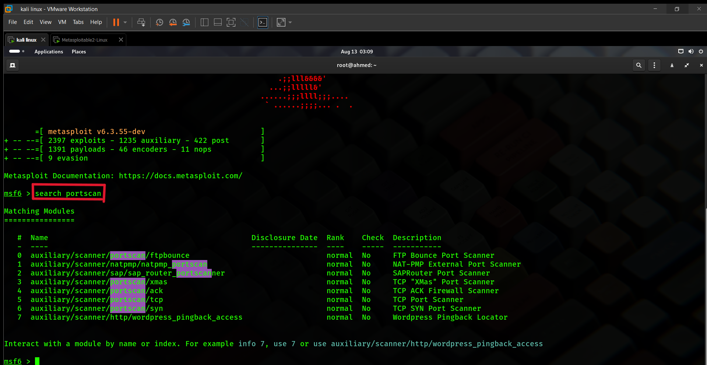
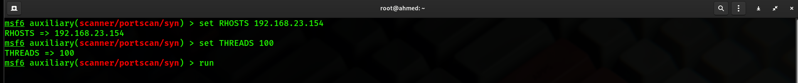

# Metasploit_project

## Introduction

Metasploit est une plateforme open-source largement utilisée dans le domaine de la cybersécurité pour les tests de pénétration et l'évaluation des vulnérabilités. Développée par Rapid7, elle permet aux professionnels de la sécurité de découvrir, exploiter et documenter les vulnérabilités présentes dans des systèmes informatiques. Metasploit offre une vaste collection d'exploits et d'outils de post-exploitation, facilitant ainsi l'identification des failles de sécurité et la démonstration de leurs impacts.

## Lab de Travail

Pour ce projet, j'ai mis en place un laboratoire de test composé de deux machines virtuelles :

- **Machine d'Attaque :** Kali Linux
  - **Adresse IP :** 192.168.23.149

- **Machine Victime :** Metasploitable
  - **Adresse IP :** 192.168.23.154

Ce laboratoire m'a permis de simuler un réseau local dans lequel j'ai pu identifier et exploiter les vulnérabilités présentes sur la machine victime à l'aide de Metasploit, tout en effectuant les attaques depuis la machine Kali.

## Méthodologie de Pénétration

La méthodologie de test de pénétration suit généralement les étapes suivantes :

1. **Reconnaissance** : Collecte d'informations sur la cible, telles que les adresses IP, les noms d'hôte, et les services en cours d'exécution.
2. **Scan de Vulnérabilités** : Identification des failles potentielles sur les systèmes et services cibles.
3. **Exploitation** : Utilisation d'exploits pour tirer parti des vulnérabilités découvertes et obtenir un accès non autorisé.
4. **Post-Exploitation** : Exploration des systèmes compromis, extraction de données sensibles, et élévation de privilèges.
5. **Rapport** : Documentation des vulnérabilités découvertes, des méthodes d'exploitation utilisées, et des recommandations pour sécuriser les systèmes.

## Reconnaissance

### 1. Scan des Ports

Pour commencer, j'ai utilisé la commande `search portscan` dans Metasploit pour rechercher des modules disponibles pour le scan de ports. Ensuite, j'ai choisi d'utiliser le module `scanner/portscan/syn` pour effectuer un scan SYN sur la cible.

- **Commande** : `search portscan`
  - Cette commande permet de rechercher des modules liés aux scans de ports disponibles dans Metasploit.

    

    
- **Module choisi** : `auxiliary/scanner/portscan/syn`
  - Ce module effectue un scan SYN, qui est une méthode couramment utilisée pour identifier les ports ouverts sur une machine cible en envoyant des segments SYN (Synchronize) et en analysant les réponses pour déterminer l'état des ports.
 
    

### 2. Configuration des Paramètres

Ensuite, j'ai configuré les paramètres pour le scan SYN en spécifiant l'adresse IP de la cible et le nombre de threads à utiliser pour accélérer le processus de scan.

- **Commande** : `set RHOSTS 192.168.23.154`
  - Cette commande configure l'adresse IP de la machine cible pour le scan.
- **Commande** : `set THREADS 100`
  - Cette commande définit le nombre de threads à utiliser pour le scan. L'utilisation de plusieurs threads permet d'accélérer le scan en effectuant des opérations en parallèle.

Enfin, j'ai lancé le scan en utilisant la commande `run`.

Ces étapes ont permis d'identifier les ports ouverts sur la machine cible, fournissant ainsi des informations cruciales pour les phases suivantes du test de pénétration.

---

## Conclusion

Ce projet démontre l'importance de la reconnaissance et du scan des ports dans un test de pénétration, en utilisant Metasploit pour identifier les vulnérabilités potentielles sur une machine cible. La configuration appropriée des scans et l'utilisation efficace des modules disponibles dans Metasploit sont essentielles pour mener à bien une évaluation de sécurité.

