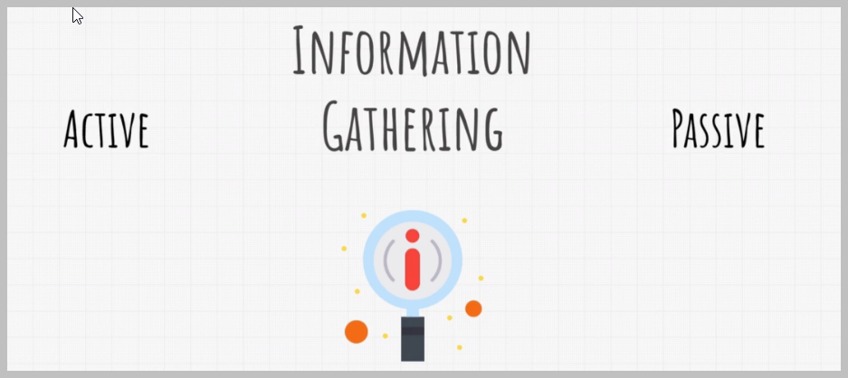

# Metasploit Penetration Testing Lab

This project demonstrates the use of Metasploit for penetration testing in a controlled lab environment. The lab consists of multiple virtual machines, each configured on a subnet for realistic testing scenarios.

## Lab Setup

### Network Configuration
- **Subnet:** 192.168.23.0/24

### Virtual Machines
- **Kali Linux**
  - **IP Address:** 192.168.23.149
  - **Role:** Attacker
  
- **Metasploitable 2**
  - **IP Address:** 192.168.23.154
  - **Role:** Vulnerable Target
  
- **Windows XP**
  - **IP Address:** 192.168.23.157
  - **Role:** Legacy System
  
- **Windows 10**
  - **IP Address:** 192.168.23.152
  - **Role:** Modern System

## Configuring PostgreSQL

An important feature of Metasploit is its backend database support for PostgreSQL, which allows us to store penetration-testing results effectively. Penetration tests often generate a large amount of data and can span several days. This makes it crucial to store intermediate results and findings, such as target host data, system logs, collected evidence, and report data, in a structured way. Metasploit’s integration with PostgreSQL enables quick and efficient storage of these results.

In this section, we will walk through the process of installing and configuring the PostgreSQL database on Kali Linux.

### Step 1: Start PostgreSQL Service

Before initializing the Metasploit database, we need to start the PostgreSQL server. we can do this by running the following command in your terminal:

```bash
systemctl start postgresql
```


### Step 2: Verify Database Initialization

As the database has already been configured, we skip the initialization step. However, if needed, the initialization can be done using the following command:

```bash
msfdb init
```

If the database is already configured, we may see the following output:


### Step 3: Verify Database Connection

We can verify that the database is successfully connected to Metasploit by launching Metasploit and checking the database status:

```bash
msfconsole
db_status
```

With the database configured, Metasploit automatically stores data from our sessions, including scanned hosts, vulnerabilities, and credentials. This feature helps us manage and analyze the results of our penetration tests efficiently.


## Creating Workspace

Workspaces in Metasploit are used to separate datasets, helping us stay organized throughout our penetration tests. By creating a new workspace for each test, we can ensure that our collected data remains isolated from previous or future tests, preventing any contamination or confusion.


To create a new workspace in Metasploit, we use the `-a` option followed by the desired workspace name. :

```bash
workspace -a metasploit_project
```


This command adds a new workspace where all the data from our current penetration test will be stored. This makes it easier to manage and review the data specific to each test.


# Information Gathering and Scanning

Information gathering and scanning are critical phases in penetration testing. These phases involve collecting data about the target network, systems, and applications to identify potential vulnerabilities. The information collected during these steps forms the foundation for the subsequent exploitation phase.


Information gathering, also known as reconnaissance, is the process of collecting as much information as possible about a target before launching an attack. This phase is crucial as it helps us understand the target’s structure, network topology, and security measures in place.

There are two primary types of information gathering:




#### 1. Passive Information Gathering

Passive information gathering involves collecting information about a target without directly interacting with the target system. This method typically involves searching publicly available information, such as WHOIS records, DNS queries, social media profiles, and other online resources. The key advantage of passive reconnaissance is that it is less likely to alert the target, as no direct probing or scanning occurs.


Examples of passive information gathering include:
- Searching for information in public databases and forums
- Analyzing metadata from publicly available documents
- Monitoring network traffic if accessible

#### 2. Active Information Gathering

Active information gathering, on the other hand, involves direct interaction with the target system. This method includes techniques like network scanning, port scanning, and vulnerability scanning, where the tester sends packets to the target to gather data. While more intrusive, active reconnaissance provides more detailed and accurate information about the target’s environment.


Examples of active information gathering include:
- Scanning the network to identify live hosts and open ports
- Enumerating services running on the target machines
- Using tools like Nmap or Metasploit’s auxiliary modules to detect vulnerabilities


For the purpose of our lab, we will focus on active information gathering. The reason for this choice is that our lab environment is designed to simulate real-world penetration testing scenarios where detailed and actionable information about the target systems is necessary. Active scanning will allow us to identify live hosts, open ports, running services, and potential vulnerabilities, which will be essential for the exploitation phase of our testing.

...
